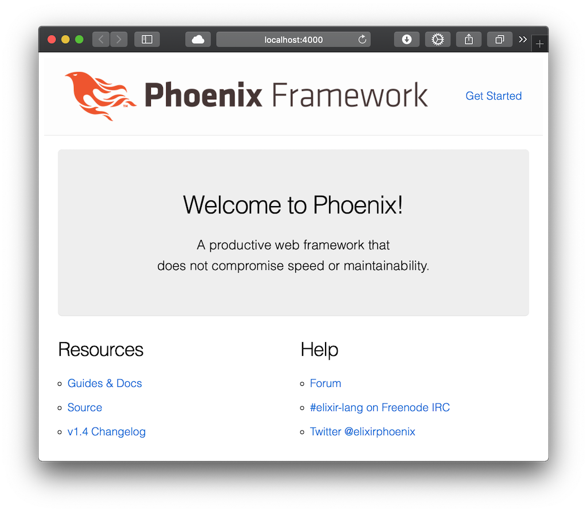

엊그제 live view [비디오](https://www.youtube.com/watch?v=8xJzHq8ru0M)와 [포스트](https://dockyard.com/blog/2018/12/12/phoenix-liveview-interactive-real-time-apps-no-need-to-write-javascript)를 읽고 감동을 받은 김에, [Programming Phoenix](https://pragprog.com/book/phoenix14/programming-phoenix-1-4)(Phoenix를 만든 사람이 쓴 책)를 따라가며 [Elixir](https://elixir-lang.org)와 [Phoenix](https://phoenixframework.org)를 익혀보기로 했다.

언어나 프레임워크에 대한 설명은 쉽게 찾아볼 수 있으니 생략하고, 일단 elixir를 설치한다. homebrew를 사용.

```bash
$ brew install elixir
```

잘 설치되어 돌아가는지는 아래와 같이 체크해볼 수 있다.

```
$ elixir -v
Erlang/OTP 21 [erts-10.1.3] [source] [64-bit] [smp:4:4] [ds:4:4:10] [async-threads:1] [hipe] [dtrace]

Elixir 1.7.4 (compiled with Erlang/OTP 21)
```

위와 같은 메시지가 나오면 ok.

이어서 elixir의 패키지 매니저인 hex를 설치한다.

```
$ mix local.hex
```

Phoenix는 데이터베이스를 다룰 때 [ecto](https://hexdocs.pm/ecto/Ecto.html)를 사용하고, ecto는 기본적으로 PostgreSQL을 사용하므로, 역시 설치해준다.

```
$ brew install postgresql
```

`postgressql`이 아니고 `postgresql`이다.

node도 필요하지만 이미 깔려있으므로 스킵.

그럼 마지막으로 phoenix를 설치해보자.

```
$ mix archive.install hex phx_new 1.4.3
```

예전 버전에선

```
$ mix archive.install https://github.com/phoenixframework/archives/raw/master/phoenix_new.ez
```

막 이랬었는데 최근 버전은 위위와 같이 간단해졌다.

설치가 완료되면, 프로젝트를 시작해보자.

```
$ mix phoenix.new hello
```

라고 책에 나와있는데, `** (Mix) The task "phoenix.new" could not be found` 메시지가 뜨면서 안된다. 버전 올라가면서 breaking change가 있었던 모양. `phoenix`가 `phx`로 바뀌었다. 아래와 같이 입력하면 잘 돌아갈 것이다.

```
$ mix phx.new hello
```

만들어진 프로젝트 폴더로 이동해 서버를 실행해보자. 아래와 같은 메시지가 뜨면 성공이다.

```
$ cd hello
$ mix ecto.create
$ mix phx.server
[info] Running HelloWeb.Endpoint with cowboy 2.6.3 at 0.0.0.0:4000 (http)
[info] Access HelloWeb.Endpoint at http://localhost:4000
...
```

역시 책엔 `mix phoenix.server` 라고 나와있는데, `phx`로 바꿔야 한다.

위의 주소를 브라우저에서 열어보면, 아래와 같이 웰컴스크린을 띄워준다.



쨘! 다음 시간엔 기본적인 컨트롤러와 라우터 동작을 알아본다.
