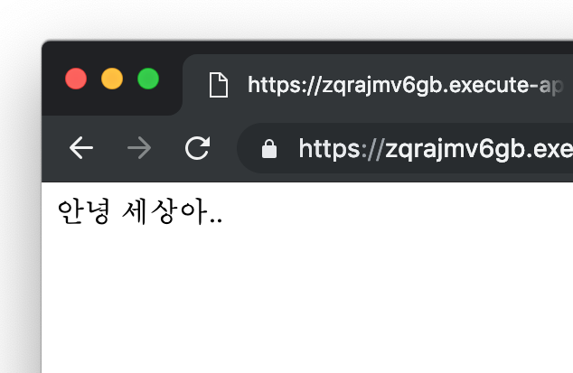

serverless로 뭔가 해봐야지 하고 있었는데 딱히 생각나는 프로젝트가 없어서 일단 hello world나 한 번 날려보자 생각하고 방법을 알아보았다. [serverless framework](https://serverless.com/)를 이용하기로 하고 보니 튜토리얼이 있어서 따라해보았다.

먼저 serveless framework을 설치한다.

```console
$ npm install -g serverless
```

미리 만들어둔 프로젝트용 AWS 계정과 연결한다.

```console
$ serverless config credentials --provider aws --key YOUR_KEY --secret YOUR_SECRET
```

serverless service를 node.js로 만들 것이므로 node 프로젝트를 만든다.

```console
$ mkdir serverless-hello-world && cd serverless-hello-world
$ npm init -f
```

[express](https://expressjs.com/)와 [serverless-http](https://github.com/dougmoscrop/serverless-http)를 설치한다.

```console
$ npm install --save express serverless-http
```

프로젝트 루트에 `index.js`를 만든다.

```js
// index.js

const serverless = require('serverless-http')
const express = require('express')
const app = express()

app.get('/', (req, res) => {
  res.send('안녕 세상아..')
})

module.exports.handler = serverless(app)
```

js코드는 이걸루 끝이다. 헤헤..

작동하는지 보려면 배포를 해야 하므로 `serverless.yml`을 아래와 같이 작성한다.

```yaml
service: serverless-hello-world

provider:
  name: aws
  runtime: nodejs8.10
  stage: dev
  region: ap-northeast-2

functions:
  app:
    handler: index.handler
    events:
      - http: ANY /
      - http: 'ANY {proxy+}'
```

그럼 한 번 배포(...)를 해보자..

```console
$ serverless deploy
```

근데 이쯤에서 `serverless`가 너무 길다는 생각이 든다. 알아보니 `sls`로 줄여쓸 수 있었다. 아무튼 명령을 실행하면 아래와 같은 메시지들이 뜨면서 아래와 같이 코드를 S3에 알아서 올려주고

```console
$ sls deploy
Serverless: Packaging service...
Serverless: Excluding development dependencies...
Serverless: Creating Stack...
Serverless: Checking Stack create progress...
.....
Serverless: Stack create finished...
Serverless: Uploading CloudFormation file to S3...
Serverless: Uploading artifacts...
Serverless: Uploading service serverless-hello-world.zip file to S3 (677.1 KB)...
Serverless: Validating template...
Serverless: Updating Stack...
Serverless: Checking Stack update progress...
.................................
Serverless: Stack update finished...
Service Information
service: serverless-hello-world
stage: dev
region: ap-northeast-2
stack: serverless-hello-world-dev
resources: 11
api keys:
  None
endpoints:
  ANY - https://jpvzlhdvn0.execute-api.ap-northeast-2.amazonaws.com/dev
  ANY - https://jpvzlhdvn0.execute-api.ap-northeast-2.amazonaws.com/dev/{proxy+}
functions:
  app: serverless-hello-world-dev-app
layers:
  None

$
```

오타가 없다면 배포에 성공하고 위와 같이 엔드포인트를 보여준다. 액세스해보면,


성공...
별 건 아니지만 역시 서버 없이 호출이 가능하다는 건 좀 신기하다.

계속 띄워놔도 상관은 없겠지만([달에 백만회](https://aws.amazon.com/lambda/pricing/) 넘게 호출할리도 없고..)
딱히 용도가 있는 것도 아니니 내려보는 것도 해보자.

```console
$ sls remove
Serverless: Getting all objects in S3 bucket...
Serverless: Removing objects in S3 bucket...
Serverless: Removing Stack...
Serverless: Checking Stack removal progress...
...................
Serverless: Stack removal finished...
```

깔끔..
🤘
